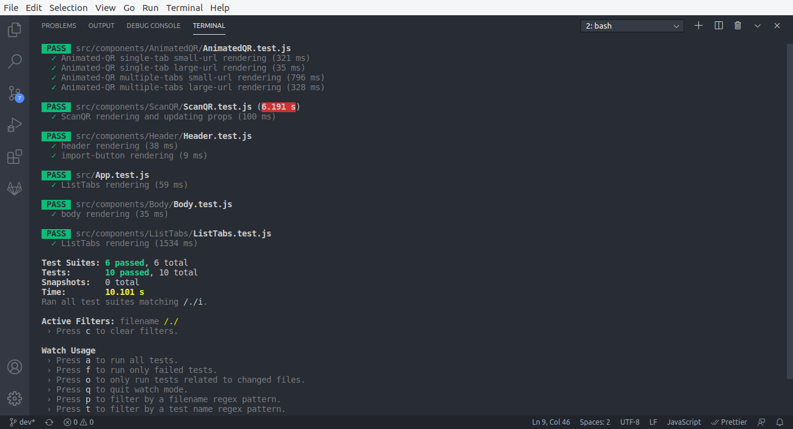
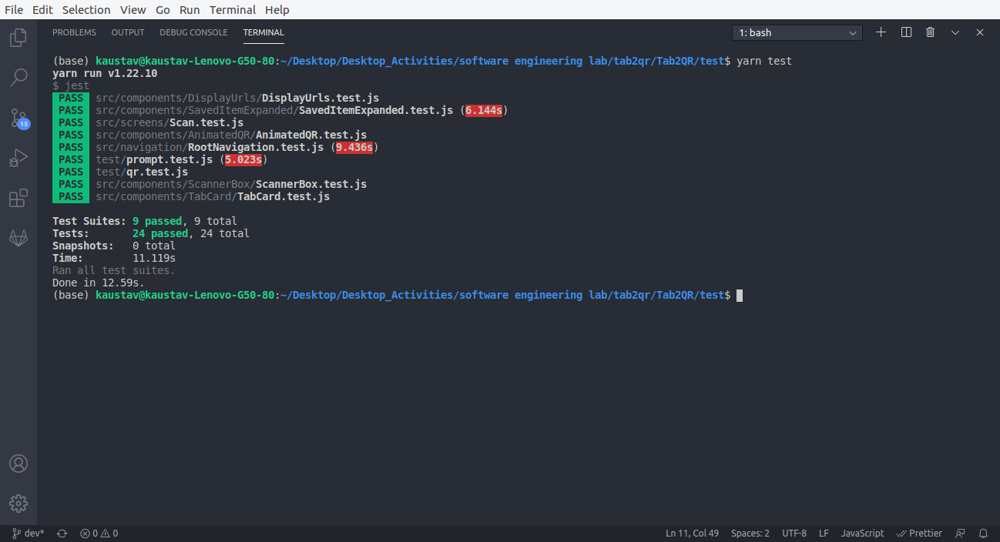
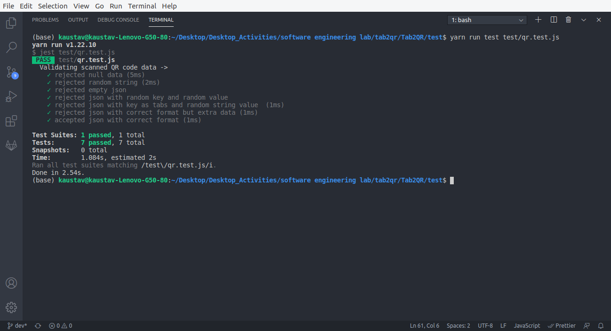
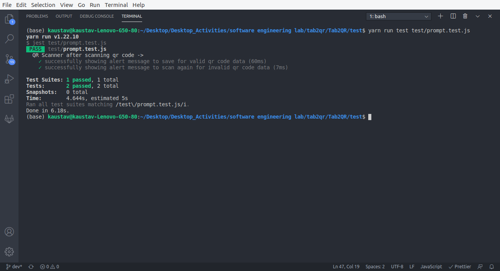

# Test

The following sections describe the tests performed for both the Tab2QR browser extension and the mobile app.

### For browser extension

Unit testing is done for every component of the browser extension. All such test files are of the form *.test.js and are included in the same path as the respective components. 

##### Screenshot of the tests performed :


### For mobile app

Unit testing is done for every component of the mobile app as well. All such test files are of the form *.test.js and are included in the same path as the respective components. 

##### Screenshot of the tests performed :


### For functional requirements

The test files are kept in  ```Tab2QR/test```  folder. Following are the screenshots for testing the functional requirements :

#### Testing that only QR code generated by the browser extension will be scanned


#### Testing that the user will be prompted to save scanned QR codes in the mobile app
